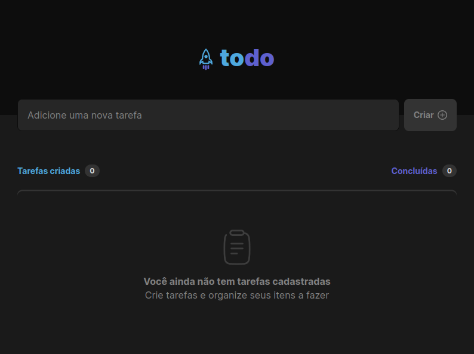
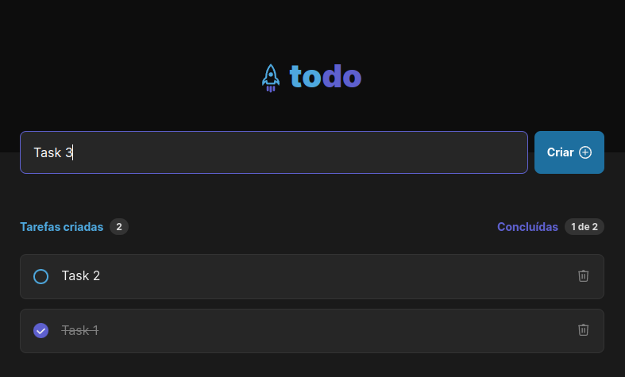

# Desafio 01 - Jornada Ignite - Trilha ReactJS

This is a simple ToDo list built with React. It is the first challenge of Jornada Ignite - Trilha ReactJS, by [Rocketseat](https://rocketseat.com.br).

This project uses TypeScript and implements some accessibility and responsiveness principles.

## Running the project

    npm install
    npm run dev

## Screenshots

